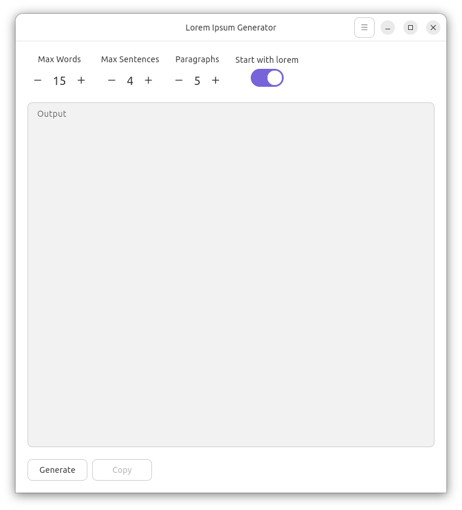
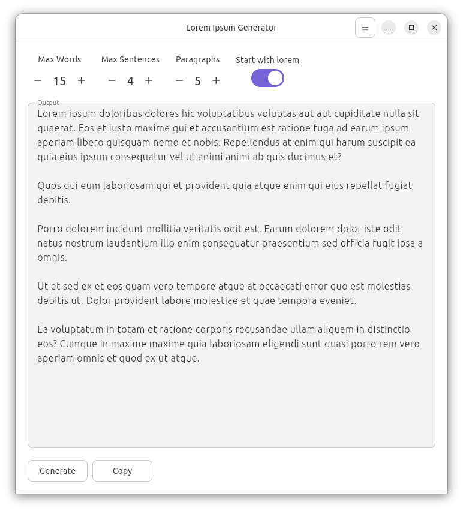

# Lorem Ipsum Generator

A simple and configurable Lorem Ipsum generator built with Flutter.

## Features

*   **Generate Lorem Ipsum Text:** Create placeholder text for your designs and mockups.
*   **Configurable Output:**
    *   Set the number of words.
    *   Set the number of sentences.
    *   Set the number of paragraphs.
*   **"Lorem Ipsum" Prefix:** Choose whether to start the generated text with the classic "Lorem ipsum dolor sit amet...".

## License

This project is licensed under the MIT License - see the [LICENSE](LICENSE) file for details.


## Screenshots

<a href="screenshots/screenshot01.png"></a>
<a href="screenshots/screenshot02.png"></a>

## Installation

1. Download the latest `.deb` package from the project's GitHub releases page.
2. Open a terminal and navigate to the directory where you downloaded the file.
3. Install the package using the following command:

   ```bash
   sudo dpkg -i [name-of-the-package].deb
   ```

